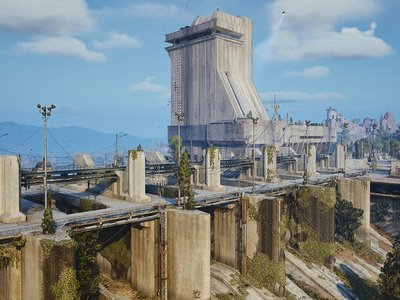

# 🗺️ Arc Raiders — Interactive Keycard Map

[](https://arcraiderskeycard.vercel.app)
[](LICENSE)
[](https://leafletjs.com)

> A free, open-source, community-driven interactive map for **Arc Raiders** — find every keycard, trace every locked door, and plan your runs.

<p align="center">
  <a href="https://arcraiderskeycard.vercel.app">
    
  </a>
  <br>
  <em>👆 Click to open the live map</em>
</p>

---

## ✨ Features

- 🔑 **Keycard Locations** — Every keycard marked with precise map coordinates
- 🚪 **Door Connections** — See which keycard opens which locked door
- 🗺️ **5 Full Game Maps** — Dam Battlegrounds, Spaceport, Buried City, Blue Gate, Stella Montis
- 🔍 **Pan & Zoom** — Smooth Leaflet.js-powered navigation with deep zoom
- 📱 **Responsive** — Works on desktop and mobile
- 🎚️ **Multi-level Support** — Upper/lower floor toggle for Stella Montis
- ⚡ **Zero Dependencies** — Pure vanilla JS, no build step, instant load

## 🛠️ Tech Stack


## 🚀 Local Development

No build tools needed — just a local server:

```bash
git clone https://github.com/jakebry/arc-raiders-map.git
cd arc-raiders-map
python3 -m http.server 8000
```

Open [http://localhost:8000](http://localhost:8000) in your browser.

## 🤝 Contributing

Contributions are welcome! Whether it's adding missing keycard locations, fixing marker positions, or improving the UI — check out [CONTRIBUTING.md](CONTRIBUTING.md) to get started.

## 📄 License

This project is licensed under the [MIT License](LICENSE).

## ⚠️ Disclaimer

This is a **fan-made project** and is not affiliated with, endorsed by, or connected to **Embark Studios** or the Arc Raiders team. All game assets, names, and imagery are property of their respective owners.

---

<p align="center">
  <strong><a href="https://arcraiderskeycard.vercel.app">🌐 Open the Live Map</a></strong>
</p>
